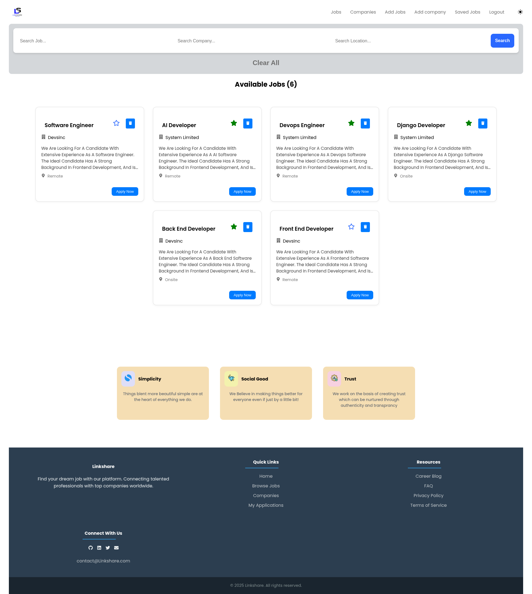
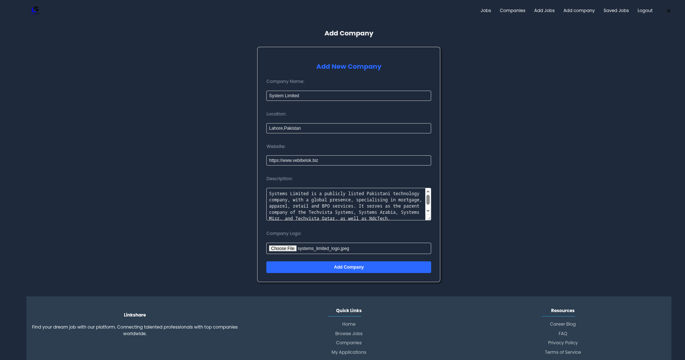
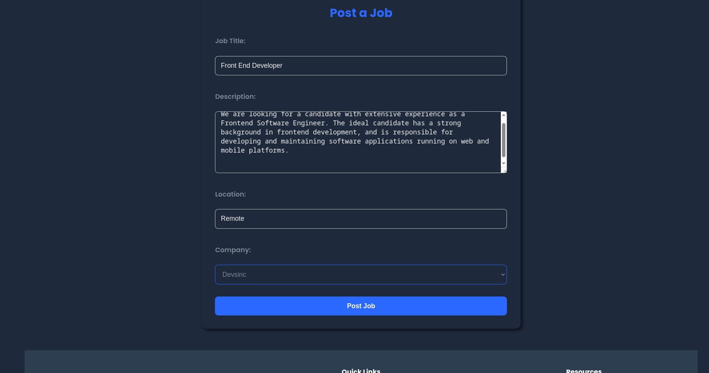
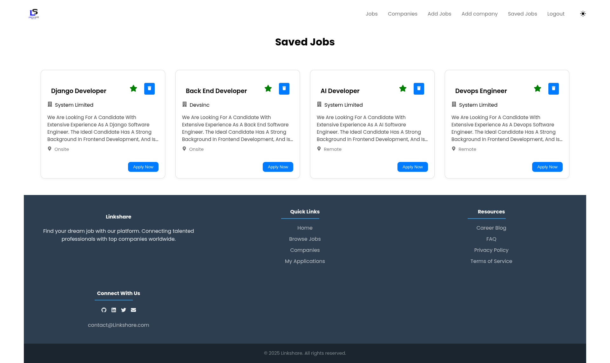
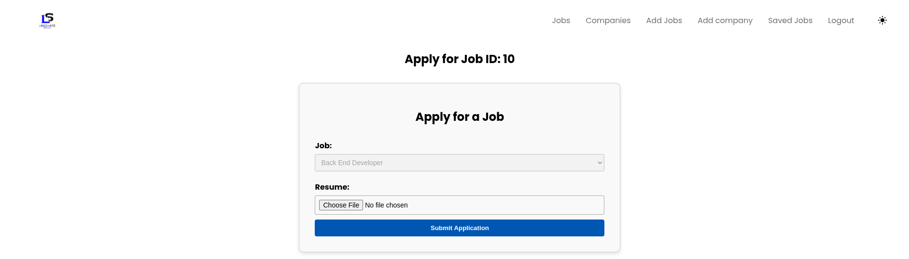

Linkshare is a full-stack web application built with React for the frontend and Django REST Framework for the backend. It leverages Django's robust architecture to manage job data through RESTful APIs, enabling efficient data handling, filtering, and integration with the React interface

Home page:

Add Company:

Post Jobs using Already create company:

Saved Jobs for later:

Apply Jobs:

