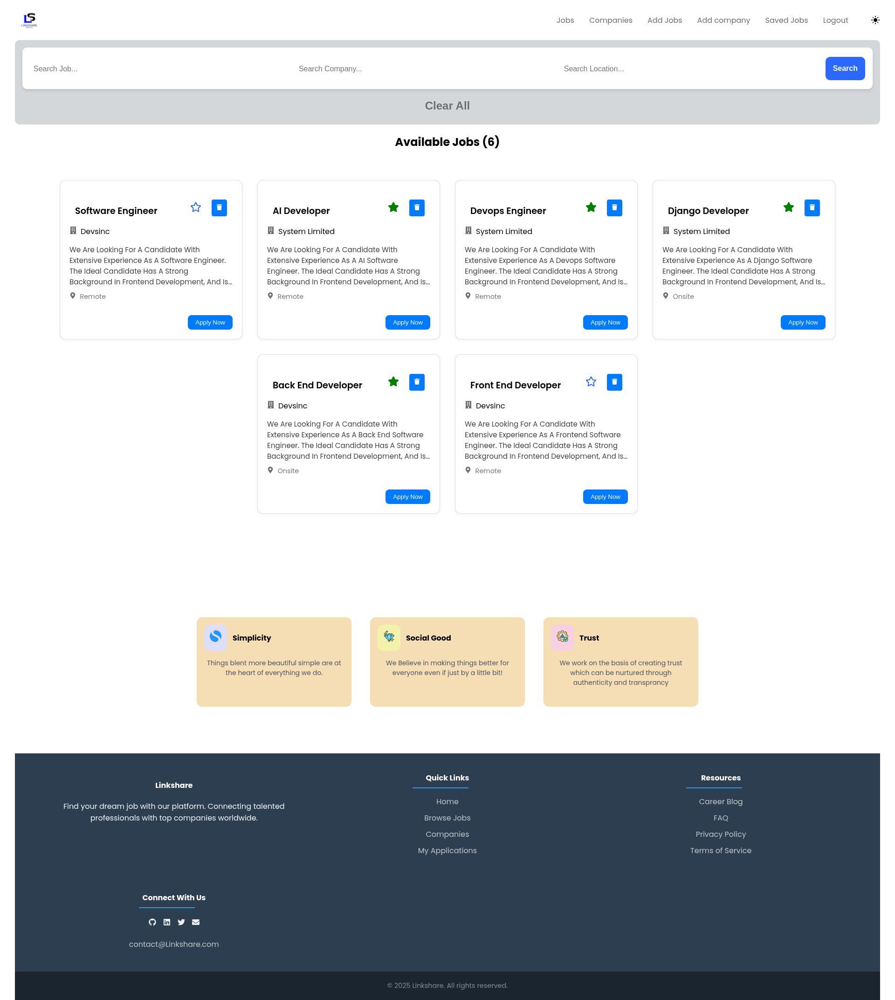
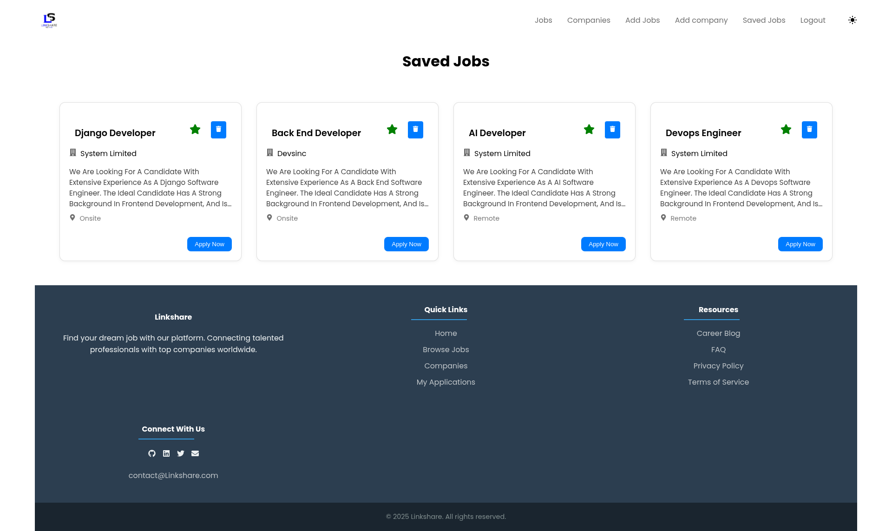
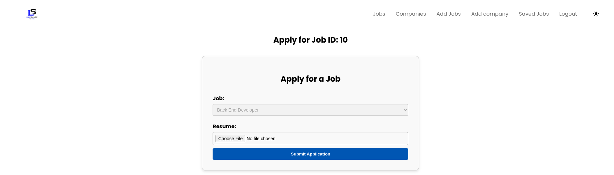

# LinkShare — Premium Modern Job Portal

LinkShare is a state-of-the-art job portal designed to connect talented professionals with top-tier organizations. Recently modernized with a "wow" aesthetic, the platform offers a seamless, high-performance experience across all devices.

## ✨ Modernization Overhaul

We have recently completely redesigned the LinkShare experience, shifting from a basic job board to a premium career platform.

- **Modern Aesthetics**: Integrated a glassmorphism-based design system with vibrant gradients and smooth `framer-motion` transitions.
- **Advanced Theme System**: Robust dynamic Light/Dark mode with persistence.
- **Refined UX**: Fixed critical layout bugs (including the "giant cross" notification issue) and standardized forms and cards for a surgical, professional feel.
- **Consistency**: Standardized typography (Inter/Poppins) and UI components across Home, Jobs, Companies, Applications, and Saved sections.

## 🚀 Key Features

- **Dynamic Job Search**: Search by title, company, or location with real-time filtering.
- **Company Management**: Dedicated space for companies to register and manage their brand identity.
- **Seamless Applications**: Optimized application workflow with resume management.
- **Personalized Dashboard**: Track applications and save opportunities for later.
- **Branded Experience**: Custom logos and high-end animations for a premium first impression.

## 🛠 Tech Stack

- **Frontend**: React (Vite), Framer Motion, React Icons (Fi), CSS3 (Custom Variables System).
- **Backend**: Django, Django REST Framework.
- **Database**: PostgreSQL / SQLite.
- **Real-Time Context**: React Context API for global message and theme management.

## 📸 Final Designs

````carousel

<!-- slide -->

<!-- slide -->

````

## ⚙️ Quick Start

### Backend
1. `cd backend`
2. `pip install -r requirements.txt`
3. `python manage.py runserver`

### Frontend
1. `cd frontend`
2. `npm install`
3. `npm run dev`

---
Built with ❤️ by the LinkShare Team. Precision engineered for the future of work.